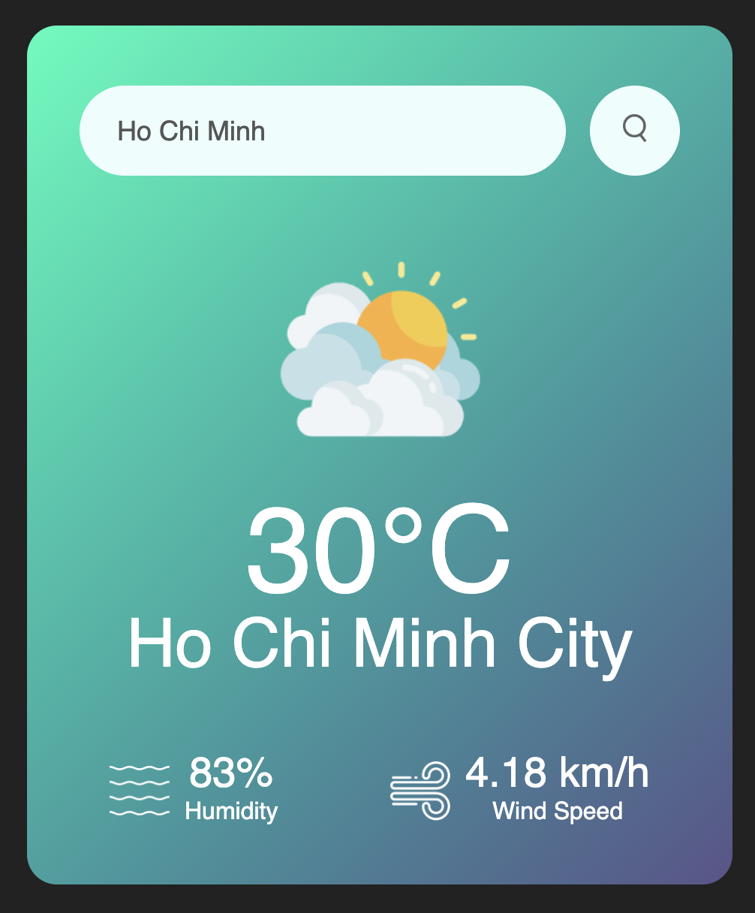

# 🌤️ Weather Web App

This weather-checking app was built by following a beginner-friendly tutorial from [GreatStack](https://youtu.be/MIYQR-Ybrn4?si=MPIiYfFZ_qiUsGmr). 
It was one of the first projects that helped me understand how to fetch data from an external API and dynamically update the UI using JavaScript.

## 🌍 Features

- 🔍 Search by city name  
- 🌡️ Show temperature, humidity, and wind speed  
- ⏱️ Real-time weather data via OpenWeatherMap API

## 🖥️ Screenshots

### Weather app

## 🛠️ Tech Stack

- HTML
- CSS
- JavaScript

## 🔗 API Used

- [OpenWeatherMap](https://openweathermap.org/api)
